# Cross-Platform Development Template and Packaging Tutorial with Vite+Vue3

 [英文](readme-en.md) | [中文](readme.md)

## Overview
- Cross-platform development has numerous advantages, making it increasingly popular in modern application development.
  1. **Cost-Effective:** Developing once and deploying on multiple platforms can significantly reduce development and maintenance costs. Developers need to write code only once and can run it on multiple platforms without the need to develop separate applications for each platform.
  2. **Time Efficiency:** Cross-platform development speeds up the application release process, as you can simultaneously build applications for multiple platforms without needing to develop separate apps for each.
  3. **Simplicity of Maintenance:** Since the codebase is shared, updating and fixing issues across all platforms is straightforward, reducing maintenance complexity and workload.
  4. **Consistent User Experience:** Cross-platform development helps ensure that users have a similar experience on different platforms, maintaining brand consistency and user satisfaction.
  5. **Scalability:** Cross-platform frameworks typically offer rich libraries and plugins to extend application functionality without rewriting platform-specific code.
  6. **Cross-Team Collaboration:** Cross-platform development promotes closer collaboration between multiple teams (e.g., front-end and back-end developers) as they can share the same codebase.
  7. **Cross-Device Compatibility:** Applications can run on various device types, including mobile devices (iOS and Android), web browsers, desktop operating systems, and more.
  8. **Rapid Iteration:** Cross-platform development supports rapid iteration and experimentation, making it easier to test new features and improvements across multiple platforms.
  9. **Wide Development Community:** Cross-platform development frameworks typically have large developer communities, providing support, tutorials, and third-party libraries, making it easier for developers to find the resources they need.
  10. **Market Coverage:** Cross-platform development allows applications to reach a wider audience by launching them on multiple platforms, catering to different user groups.

## Introduction
- This development environment is based on a Vite project, compiled using the HBuilder compiler of UniApp to create an APK file. The architecture used here is based on a web container (webView).

## Quick Start
- Clone the project
  - `git clone https://github.com/LayFz/Vite2Android.git`

- Install dependencies
  - `npm install`

- Run the project
  - `npm run dev`

## Core Features
- Main dependencies in the project
  ```json
    "dependencies": {
      "axios": "^1.2.0",
      "vant": "^4.7.2",
      "vue": "^3.3.4",
      "vite-plugin-style-import": "^1.4.1",
      "vue-router": "^4.1.6"
    },
  ```
- **Request Encapsulation**

  The project utilizes Axios for request encapsulation. The following code example demonstrates this:

  ```javascript
  import axios from "axios";
  import router from '../router/router'
  
  // export const baseURL = "http://api.staraid.cn:8088/";
  const baseURL = "https:/localhost:8088";
  
  // Create an Axios instance
  const service = axios.create({
    baseURL,
  });
  
  // Request Interceptors
  service.interceptors.request.use(
    (config) => {
      const token = localStorage.getItem('token')
      config.headers['Authorization'] = token
      return config;
    }
    // error => {
    //   return Promise.reject("An error occurred");
    // }
  );
  
  // Response Interceptors
  /**
   * Implement the corresponding actions according to the backend development standards
   * 
   */
  service.interceptors.response.use(
    (response) => {
      // Perform subsequent actions based on different status codes
      // console.log("Returned data", response);
      if (response.data.code !== '00000') {
          localStorage.clear()
          router.push('/login')
      }
      return response;
    },
    error => {
        if (error.response.data.code === 'A1871') {
            localStorage.clear()
            router.push('/login')
        }
      return Promise.reject(error);
    });
  export default service;


As shown in the above code, you can customize guard routes and other related functionalities.

## Important Considerations for Vite Development

- In the `vue.config.js` file, it's essential to pay attention to the relative paths during packaging to prevent path mismatch errors.

  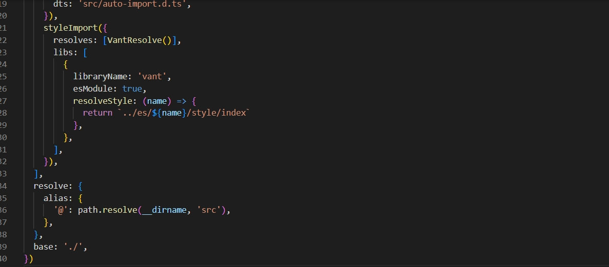

  <span id="care">Declare it within the `defineConfig` node to ensure that relative paths do not cause errors during packaging.</span>
  
    ```javascript
    base: './'
	  ```

- In the index.html file, it contains the following code:
- ```index.html
  <!doctype html>
  <html lang="en">
  
  <head>
    <meta charset="UTF-8" />
    <link rel="icon" type="image/svg+xml" href="/vite.svg" />
    <meta name="viewport" content="width=device-width, initial-scale=1.0" />
    <title>Music Applicaition</title>
  </head>
  
  <body>
    <div id="app"></div>
    <script type="module" src="/src/main.js"></script>
    <script>
      // 禁用缩放
      function addMeta() {
        document
          .getElementsByTagName('head')[0]
          .append(
            '<meta name="viewport" content="width=device-width,initial-scale=1,minimum-scale=1,maximum-scale=1,user-scalable=no" />'
          )
      }
      setTimeout(addMeta, 3000)
  
      // 禁用双指放大
      document.documentElement.addEventListener(
        'touchstart',
        function (event) {
          if (event.touches.length > 1) {
            event.preventDefault()
          }
        },
        {
          passive: false,
        }
      )
  
      // 禁用双击放大
      var lastTouchEnd = 0
      document.documentElement.addEventListener(
        'touchend',
        function (event) {
          var now = Date.now()
          if (now - lastTouchEnd <= 300) {
            event.preventDefault()
          }
          lastTouchEnd = now
        },
        {
          passive: false,
        }
      )
    </script>
  
    <script>
      document.addEventListener('plusready', function () {
        var first = null;
        var webview = plus.webview.currentWebview();
        plus.key.addEventListener('backbutton', function () {
          webview.canBack(function (e) {
            if (e.canBack) {
              webview.back(); //这里不建议修改自己跳转的路径  
            } else {
              //首次按键，提示‘再按一次退出应用’  
              if (!first) {
                first = new Date().getTime(); //获取第一次点击的时间戳  
                // console.log('再按一次退出应用');//用自定义toast提示最好  
                // toast('双击返回键退出应用'); //调用自己写的吐丝提示 函数  
                plus.nativeUI.toast("再按一次退出应用", {
                  duration: 'short'
                }); //通过H5+ API 调用Android 上的toast 提示框  
                setTimeout(function () {
                  first = null;
                }, 1000);
              } else {
                if (new Date().getTime() - first < 1000) { //获取第二次点击的时间戳, 两次之差 小于 1000ms 说明1s点击了两次,  
                  plus.runtime.quit(); //退出应用  
                }
              }
            }
          })
        });
      });
    </script>
  </body>
  </html>
  ```
  The JavaScript part of the above code provides detailed instructions on configuring the Android app exit behavior and managing route guard permissions. Users can tailor these based on their specific needs. The final behavior for exiting the Android app is presented as follows, where the code checks if the user has triggered the exit action within one second:

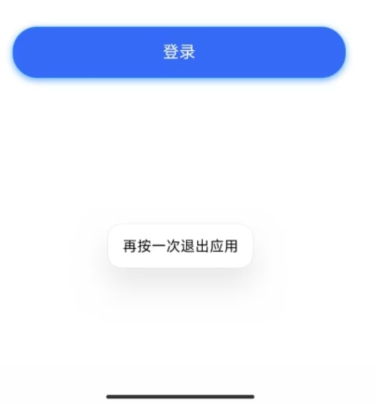

## How to Package

- Step 1

  - Execute `npm run build`.

    - 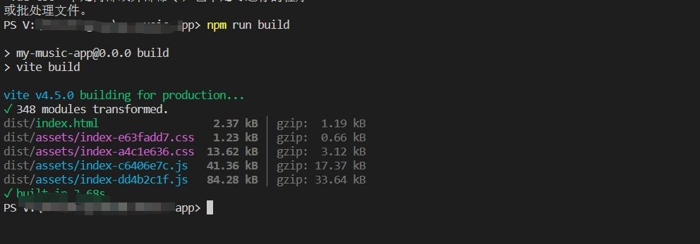

      This will generate the packaged `dist` directory.

    - 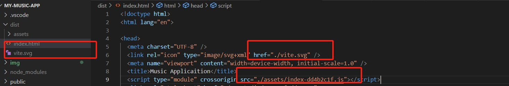

      It's essential to verify that the files referenced in your project adhere to relative path rules. Mismatches may result in a white screen issue, so please review the [considerations](#care) carefully.

- Step 2

  - Open Hbuilder and create a new H5+ project.

    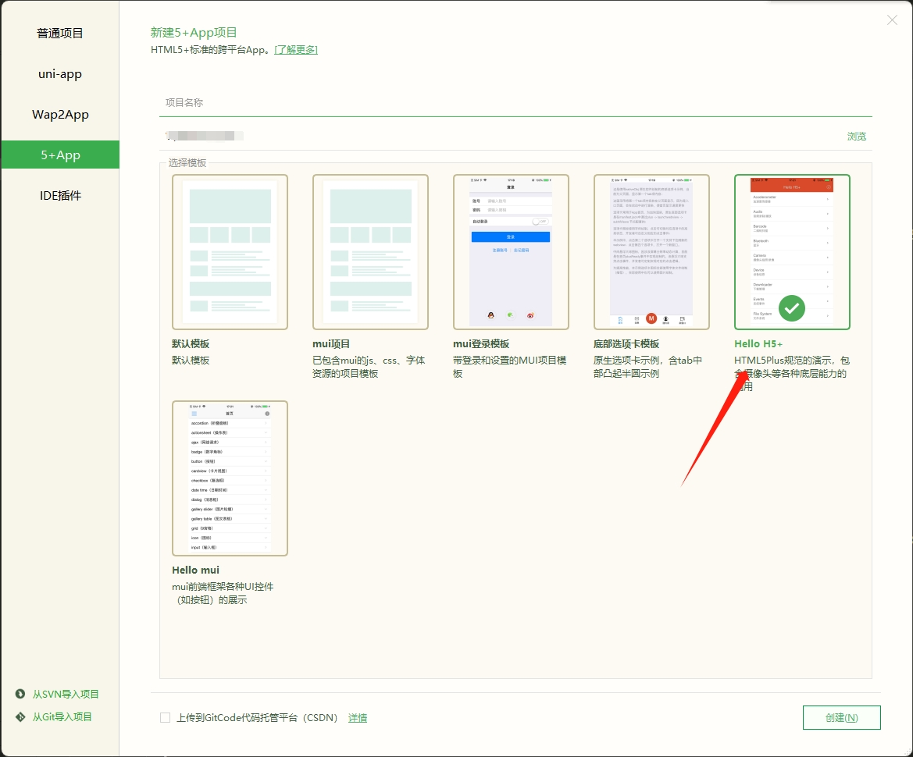

  - The directory structure at this point appears as follows:

    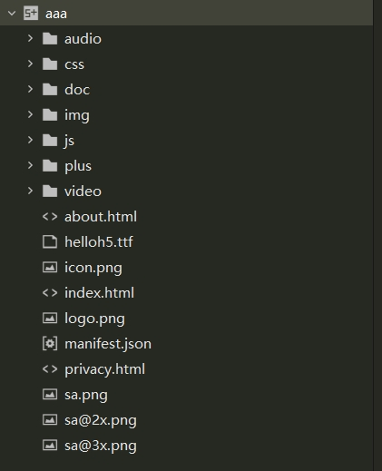

  - Remove all files except for `manifest.json`.

    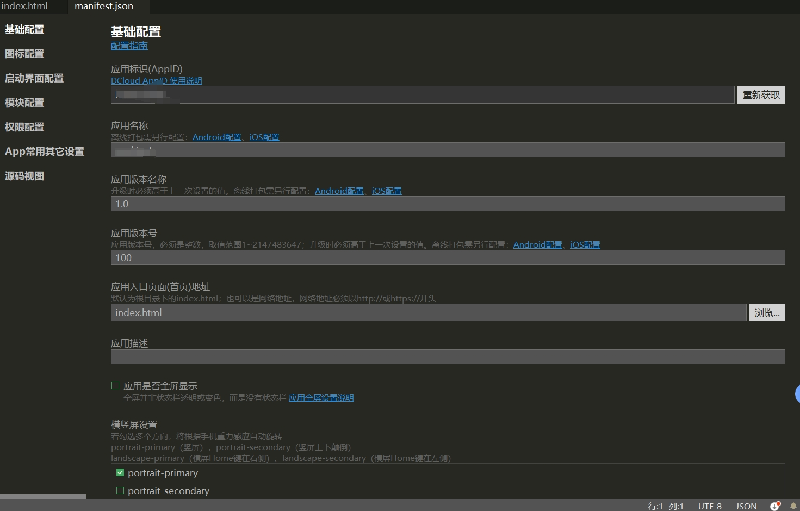

    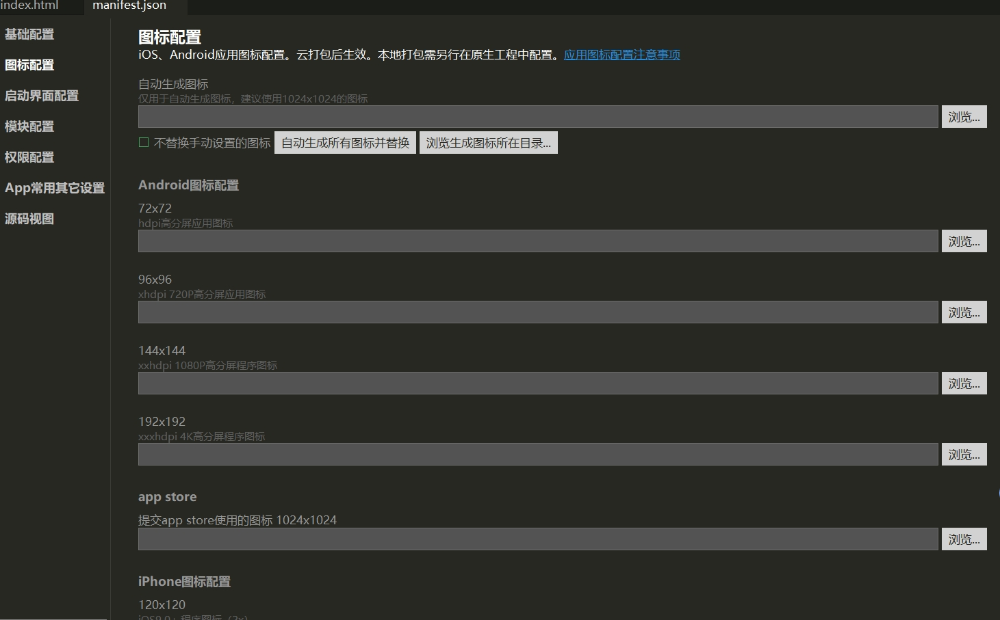

    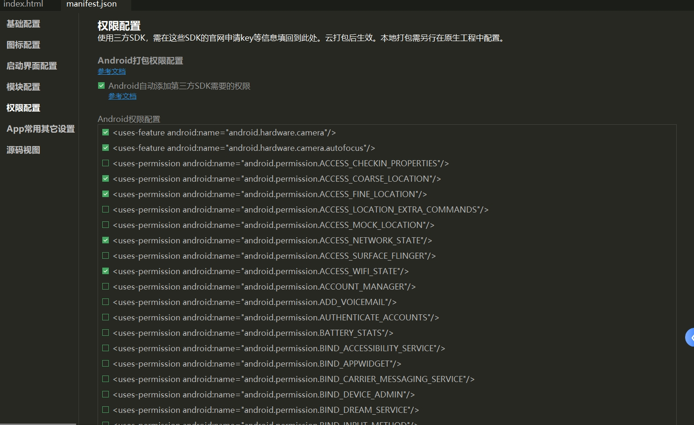

    The provided files include the necessary app icons and permission-related configurations. You can customize them as needed.

- Step 3

  - Copy all the content from the packaged `dist` directory to the main directory of the H5+ project, as shown below:

    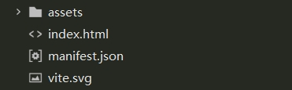

- Step 4

  - Click on `Publish` -> `Cloud Package`.

    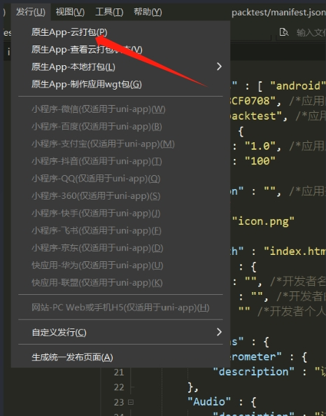

    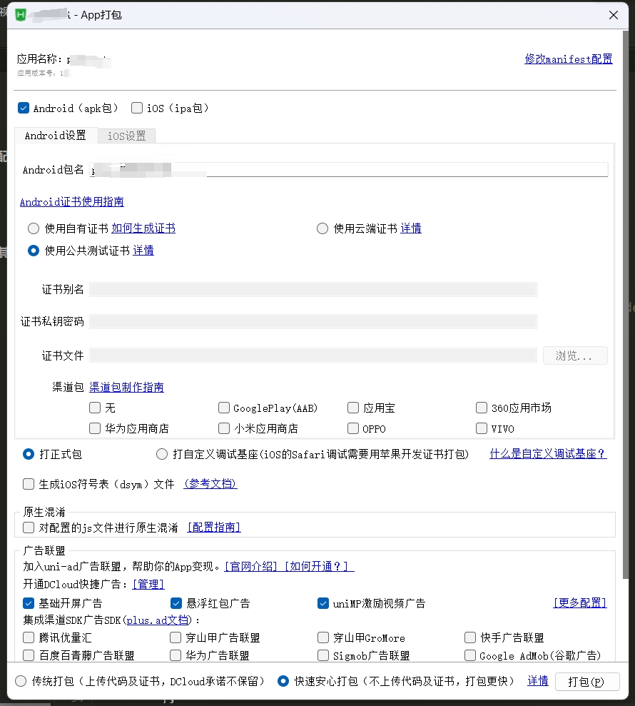

    As shown above, customize the packaging based on your requirements. The process may take several minutes. During the validation process, it's recommended to use the keystore generated by native Android. If you're conducting a test, it may not be necessary. Typically, Android Studio can be used for native environment packaging as well.

    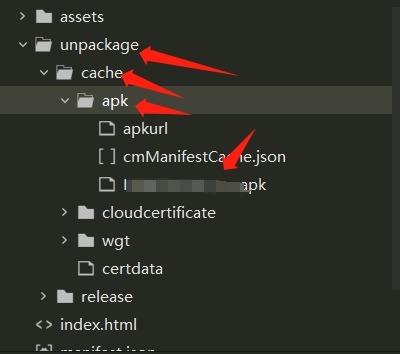

    The result after the packaging is the `unpackage` directory, containing the APK file path. You can install and test it on an Android device.

## References

- [UniApp](https://uniapp.dcloud.io/)
- [Vite | Next Generation Frontend Tooling (vitejs.dev)](https://vitejs.dev/)
- [Vue.js - Progressive JavaScript Framework | Vue.js](https://vuejs.org/)
- [UniApp - https://uniapp.dcloud.net.cn/](https://uniapp.dcloud.net.cn/)